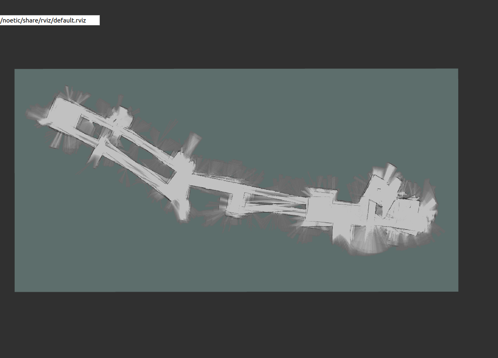

# Simultaneous Localization and Mapping

## Description
The system is divided into three main parts, mobility, mapping, and visualization. The mapping portion is where real-time simultaneous localization and map processing is done to generate 2D maps with the aid of Google Cartographer, ROS, and 360 LiDAR. The mobility of the system is provided by the Sphero rover which is controlled remotely through the Sphero app via Bluetooth to manuever the system throughout its environment. As the rover advances through an area the 360 LiDAR mounted on top of the rover sends laser scan data to the Raspberry Pi via USB and the data gets processed by the Google Cartographer SLAM algorithm. When the data gets processed the map is displayed using ROS's 3D visualization tool called rviz. The map processing is done on the Raspberry Pi while the visualization is captured on a laptop, setup using a master/slave configuration through ROS on the same wifi network. Combined together the system can localize itselfs within its environment and generate a 2D map in real time on a small low power device.

## Project Build

## Map Quality

## Video Demonstration
https://youtu.be/31oRrxS-QlA

